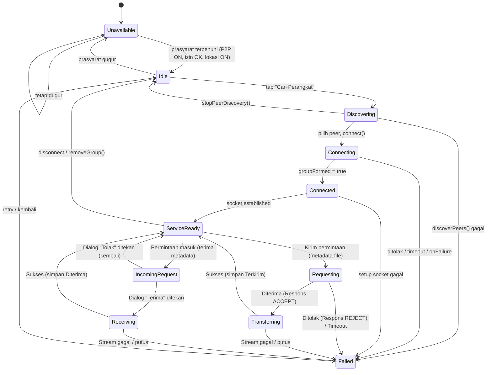

```markdown
# PRD: Wi-Fi Direct File Transfer (MVVM)

**Platform:** Android · Kotlin · Jetpack Compose · Material Design 3 
**Konektivitas:** WifiP2pManager (Wi-Fi Direct) — offline, tanpa internet 
**Arsitektur:** MVVM + Clean Architecture (domain/data/ui)

```

---

## 1. Ringkasan & Keputusan Arsitektur

| Keputusan | Pilihan | Alasan |
| --- | --- | --- |
| Mode komunikasi | **Kirim sekali jalan** (pesan teks + lampiran dalam satu transfer), bukan chat dua arah berkelanjutan | Fokus proyek adalah file transfer, bukan messaging |
| Transport data | **Opsi A: ServerSocket/Socket bawaan SDK** | Menggunakan socket mentah tanpa *embedded HTTP server*. Tidak ada *library* baru, protokol sepenuhnya di bawah kendali sendiri untuk memudahkan pembelajaran tim dan *debugging* yang lebih minim lapisan abstraksi. |
| Riwayat transfer | **Room** (entity `TransferRecordEntity`, DAO `Flow`) | Riwayat harus bertahan lintas sesi aplikasi; Room idiomatik untuk data terstruktur di Android dan menyatu alami dengan Flow/MVVM |
| Cakupan 7 materi Native Android | Target **6 dari 7** (lihat pemetaan di §4) | Rubrik Networking #5 dikorbankan (*by design*) karena prioritas pada waktu *development* yang singkat dan kemudahan pemahaman kode base. |

---

## 2. Matriks Fitur (Revisi)

| ID | Fitur | Deskripsi Fungsional | Komponen Teknis | Prioritas |
| --- | --- | --- | --- | --- |
| FT-01 | Status Wi-Fi P2P | Deteksi real-time via `WIFI_P2P_STATE_CHANGED_ACTION` + pembacaan state awal aktif. Jika mati, banner dengan tombol ke pengaturan. | `WifiP2pDataSource` (`callbackFlow`) → `P2pRepository` → `ConnectionViewModel` | Wajib |
| FT-02 | Peer Discovery | Tombol "Cari Perangkat" memanggil `discoverPeers()`; daftar peer dari `WIFI_P2P_PEERS_CHANGED_ACTION` → `requestPeers()`. Tampilkan status peer (Available/Invited/Connected). | `DiscoverPeersUseCase`, `DiscoveryViewModel` (UiState Loading/Success/Error) | Wajib |
| FT-03 | Peer Connection | `connect()` dengan `WifiP2pConfig`; konfirmasi via `WIFI_P2P_CONNECTION_CHANGED_ACTION`. Tangani menunggu persetujuan, ditolak, timeout, `cancelConnect()`. | `ConnectToPeerUseCase` → `P2pRepository.connect()` | Wajib |
| FT-04 | Socket Establishment | Dari `requestConnectionInfo()`: jika `isGroupOwner`, buka `ServerSocket().accept()`; jika peer, lakukan `connect` ke `groupOwnerAddress` dengan logika *retry/backoff*. | `SocketDataSource` (`Dispatchers.IO`) | Wajib |
| FT-05 | Kirim Transfer | Protokol dua-fase via `OutputStream`/`InputStream`. Pengirim mengirim permintaan (metadata). Penerima memunculkan dialog. Jika Diterima, pengirim memulai stream *bytes* file. | `SendTransferUseCase`, `ObserveIncomingTransferUseCase`, `RespondToTransferUseCase`, `TransferViewModel` | Wajib |
| FT-06 | Izin & Mode Lokasi | `NEARBY_WIFI_DEVICES` (API 33+) atau `ACCESS_FINE_LOCATION` (≤32) + cek Mode Lokasi. Jelaskan alasan izin; arahkan ke Settings bila ditolak permanen. | `ObservePrerequisitesUseCase`, `rememberLauncherForActivityResult` | Wajib |
| FT-07 | Sesi & Disconnect | State machine (lihat §3). Tangani `removeGroup()`/`cancelConnect()`, channel hilang, putus mendadak. Sesi dipegang singleton. | `P2pRepositoryImpl` (Application scope), `DisconnectUseCase` | Wajib |
| FT-08 | Protokol Transfer | Definisi *frame* biner via `MessageCodec` (bukan skema multipart HTTP). Mengatur pembacaan/penulisan frame permintaan, respons ACCEPT/REJECT, dan streaming data file. | `MessageCodec` | Wajib |
| FT-09 | Pilih & Simpan File | Picker sistem (tanpa izin storage), baca streaming via `ContentResolver`, simpan file masuk via MediaStore. | `FileDataSource` | Wajib |
| FT-10 | Progres & Pembatalan | Progres stream per file (`StateFlow`); tombol batal. | `TransferRepository`, `TransferViewModel` | Sebaiknya |
| FT-11 | Riwayat Transfer | Simpan `TransferRecord` ke Room **setelah** transfer file selesai atau diterima. `LazyColumn` dengan key id record. | `TransferRecordEntity`, `TransferHistoryDao`, `HistoryViewModel` | Sebaiknya |

---

## 3. State Machine Koneksi

State `ServiceReady` dicapai saat *socket* sudah *established*. Proses transfer file sekarang melalui fase permintaan konfirmasi (berdasarkan alur dua-fase).



---

## 4. Pemetaan ke 7 Materi Native Android

| # | Materi | Status | Sumber Pemenuhan |
| --- | --- | --- | --- |
| 1 | UI & Layout Dasar | Terpenuhi | Semua layar (`Column`, `Row`, `Box`, `Modifier`) |
| 2 | Material Design 3 | Terpenuhi | Tema, `Card` peer, `Button`, `OutlinedTextField` pesan |
| 3 | State Management & UDF | Terpenuhi | `StateFlow` ViewModel → UI, `rememberSaveable` input pesan, State Hoisting |
| 4 | Lazy Layouts | Terpenuhi | `LazyColumn` daftar peer (key `deviceAddress`) & riwayat (key id record) |
| 5 | Networking & API | **Tidak dipakai** | Dikorbankan *by design* karena menggunakan raw Socket SDK, (6 dari 7 materi sudah cukup memenuhi rubrik). |
| 6 | Arsitektur MVVM | Terpenuhi | `ViewModel` + `UiState` (Loading/Success/Error) per layar |
| 7 | Navigation Compose | Terpenuhi | 3 layar (Cari, Transfer, Riwayat) type-safe, data antarlayar, `Scaffold` + `NavigationBar` |

---

## 5. Struktur Package MVVM

```
/
├── P2pApp.kt                     // Application: init AppContainer, Room database
├── MainActivity.kt               // setContent + permission launcher host
├── di/
│   └── Module.kt           // Hilt opsional
├── domain/
│   ├── model/                    // Peer, PeerStatus, ConnectionState, TransferRecord,
│   │                             //   TransferProgress, P2pError, IncomingTransferRequest
│   ├── repository/               // P2pRepository, TransferRepository (interface)
│   └── usecase/                  // ObservePrerequisitesUseCase, DiscoverPeersUseCase,
│                                 //   ConnectToPeerUseCase, DisconnectUseCase,
│                                 //   SendTransferUseCase, ObserveIncomingTransferUseCase,
│                                 //   RespondToTransferUseCase
├── data/
│   ├── p2p/                      // WifiP2pDataSource (manager, channel, callbackFlow)
│   ├── socket/                   // Pengganti layer network: SocketDataSource.kt, MessageCodec.kt
│   ├── file/                     // FileDataSource (ContentResolver, MediaStore)
│   ├── local/
│   │   ├── TransferRecordEntity.kt
│   │   ├── TransferHistoryDao.kt
│   │   └── AppDatabase.kt        // Room
│   ├── mapper/                   // WifiP2pDevice -> Peer, Entity <-> TransferRecord
│   └── repository/               // P2pRepositoryImpl (singleton), TransferRepositoryImpl
└── ui/
    ├── theme/                    // Color, Type, Theme (M3)
    ├── navigation/               // Routes (@Serializable), AppNavHost, bottom bar
    ├── components/               // PeerCard, AttachmentRow, PrerequisiteBanner, TransferProgressBar
    ├── root/                     // Dialog host activity-scoped ("Permintaan Transfer Masuk")
    ├── connection/               // ConnectionViewModel (activity-scoped: prasyarat + status)
    ├── discovery/                // DiscoveryScreen, DiscoveryViewModel, DiscoveryUiState
    ├── transfer/                 // TransferScreen (compose + hasil), TransferViewModel
    └── history/                  // HistoryScreen, HistoryViewModel

```

---

## 6. Asumsi Terbuka (perlu disepakati kelompok)

1. Dialog konfirmasi **"Permintaan Transfer Masuk"** tidak terikat pada satu layar, melainkan akan di-*host* di level *root/activity* (mirip notifikasi global). Hal ini mencegah permintaan terlewat apabila pengguna sedang membuka tab Riwayat atau Cari Perangkat saat ada transfer masuk di status `ServiceReady`.
2. Satu entri Riwayat mewakili satu paket transfer (pesan + seluruh lampirannya), bukan per file individual.

```

```